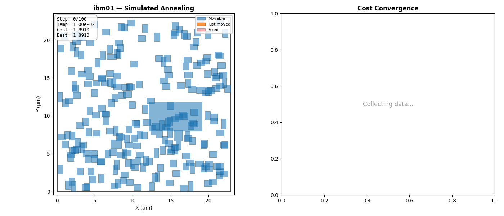
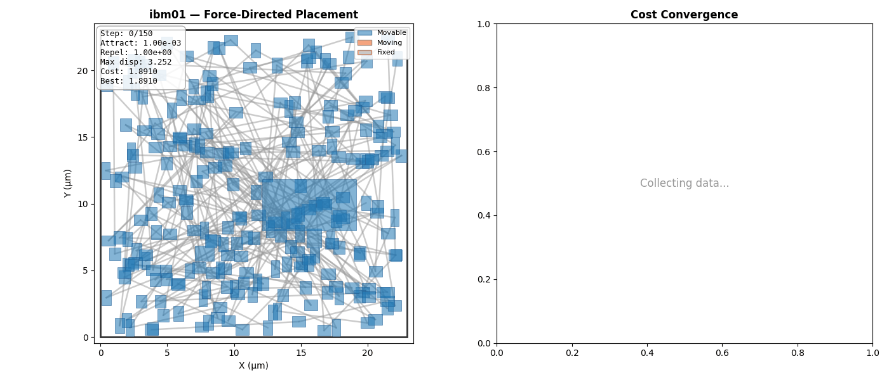

# LKH Placer — How it Works and How to Use It

A macro placement system that refines an analytical seed placement
(RePlAce or DREAMPlace) via a Lin-Kernighan-style cascading local search
guided by three learned components: a GNN state encoder, an MLP cost
approximator, and a PPO actor-critic policy. Training infrastructure runs
either locally or on Modal cloud.

## TL;DR — the 3 main commands

**1. Start a training run on Modal** (one-time `uv add modal && uv run modal setup` first):

```bash
uv run modal run --detach submissions/lkh/modal_run.py::iter_ \
    --benchmark all --rounds 4 --examples 75 \
    --policy-iterations 1500 --eval-time-budget 20
```

Returns in ~10 seconds; the actual training runs in the background for ~3 hours.
You can close your laptop. Modal will email you when it finishes.

**2. Watch progress** (from any terminal, anytime):

```bash
modal app logs lkh-macro-place               # live log stream
modal volume ls lkh-results /iter/per_bench  # which benchmarks finished collecting
modal volume ls lkh-results /iter            # which rounds finished
```

**3. Collect results** (after Modal emails "completed"):

```bash
# Pull everything from the volume
modal volume get lkh-results /iter ./modal_output

# Promote trained checkpoints to local
cp modal_output/iter/checkpoints/*.pt submissions/lkh/checkpoints/

# Verify the placer with the new models
uv run python -m macro_place.evaluate submissions/lkh/placer.py --all
```

Everything else below is reference material for tuning, debugging, and local development.

---

## Pipeline at a Glance

```
initial.plc                                                     valid
(input)                                                         placement
   |                                                              ^
   v                                                              |
PlacementState                                               Legalization
(numpy arrays)                                               (outward spiral)
   |                                                              ^
   v                                                              |
LK Chain ----score candidates-----> +-- ChainPolicy (PPO)          |
(cascading                          |   if checkpoint loaded      |
 macro moves)                       +-- CostApproximator (MLP)    |
   |                                |   if checkpoint loaded      |
   |                                +-- HPWL surrogate            |
   |                                    (default fallback)        |
   |                                                              |
   +---chain commit gate---> best placement -> legalize ----------+
       (lex: overlap_pairs,
        then HPWL)
```

The placer runs a wall-clock-bounded loop of chains; each chain cascades
moves through the state. After the loop, a legalization pass forces
overlaps to zero so the output is a valid competition submission.

## What's in This Directory

| File | Role |
|---|---|
| `placer.py` | The placer (`LKHPlacer`). Contains `PlacementState`, `LKChain`, `_legalize`, checkpoint loaders. This is what the competition evaluator calls. |
| `lkh_model.py` | The two MLP/actor-critic models: `CostApproximator` and `ChainPolicy`. |
| `chain_env.py` | `ChainEnv` — wraps `PlacementState` as a Gym-style RL environment for PPO. |
| `encoder.py` | `PlacementGNN` + `CanvasCNN` + `StateEncoder`. Consumed by the runtime wrappers and training scripts. |
| `encoder_runtime.py` | GNN-only encoder runtime used at inference and during joint training. |
| `seed_loader.py` | Loads an analytical seed placement (RePlAce / DREAMPlace) from `seeds/`. |
| `seed_head.py` | Learned seed-selection head; co-stored with the chain policy checkpoint. |
| `fast_legalize.py` | Fast in-loop legalizer used for the post-legalization reward signal. |
| `commit_gate_scalar.py` | Scalar commit-gate scoring: predicted Δproxy + overlap penalty. |
| `train.py` | Trainer for `CostApproximator`. Collects `(features, exact_Δproxy_cost)` triples. |
| `train_encoder_joint.py` | Joint regression trainer for encoder + cost approximator. |
| `train_policy.py` | PPO trainer for `ChainPolicy` (and seed head when enabled). |
| `train_iter.py` | Iterative loop: cost-model training + PPO + per-benchmark evaluation. |
| `ablate.py` | Ablation runner: compares placer configurations on a benchmark. |
| `visualize.py` | Side-by-side renders: initial placement vs LKHPlacer output, with displacement arrows. |
| `modal_run.py` | Modal entry points (smoke, train, policy, iter\_). All long-running training jobs go through this. |
| `checkpoints/` | Trained weights (`cost_approximator.pt`, `chain_policy.pt`). The placer auto-loads if present. |
| `data/` | Cached training data. `chain_data.pt` is the aggregated dataset; `per_bench/` has per-benchmark caches that survive preemption. |
| `iter_output/` | Per-round archival from `train_iter.py` (round\_0/, round\_1/, ..., history.json). |

## Local Workflows

### Evaluate the placer

```bash
# Single benchmark (uses whatever checkpoints exist in checkpoints/)
uv run python -m macro_place.evaluate submissions/lkh/placer.py -b ibm01

# All 17 IBM benchmarks
uv run python -m macro_place.evaluate submissions/lkh/placer.py --all

# Hide checkpoints to test the no-learning baseline
mv submissions/lkh/checkpoints submissions/lkh/checkpoints.bak
uv run python -m macro_place.evaluate submissions/lkh/placer.py -b ibm01
mv submissions/lkh/checkpoints.bak submissions/lkh/checkpoints
```

The evaluator prints `proxy=<cost>  overlaps=<n>  VALID/INVALID` per benchmark.
A valid submission has `overlaps=0` on every benchmark.

### Ablation (compare A/B/C/D)

```bash
uv run python submissions/lkh/ablate.py --time-budget 30 --benchmark ibm01
```

Prints a comparison table of the four configurations.

### Visualize a placement

```bash
uv run python submissions/lkh/visualize.py --benchmark ibm01 --time-budget 30
# -> vis/ibm01_compare.png  (initial | placer output, with displacement arrows)

# Multiple benchmarks
uv run python submissions/lkh/visualize.py --benchmark ibm01,ibm07 --no-arrows
```

### Train locally (for quick experiments)

```bash
# Cost approximator alone (on ibm01)
uv run python submissions/lkh/train.py --benchmark ibm01 --num-examples 200

# PPO policy alone (on ibm01)
uv run python submissions/lkh/train_policy.py --benchmark ibm01 --iterations 200

# Full iterative pipeline (small, ~5 min)
uv run python submissions/lkh/train_iter.py \
    --benchmark ibm01,ibm07 --rounds 1 --examples 20 --policy-iterations 100
```

Local training is fine for development but slow at scale. For real training,
use Modal.

## Modal Workflows (the main path)

Modal lets us run training on rented CPUs in parallel. Used for any training
that needs more than a few minutes.

### One-time setup

```bash
# Install the Modal CLI in this project
uv add modal

# Authenticate (opens browser to your Modal account; you should have credits
# to your Modal account)
uv run modal setup
```

### Smoke-test the Modal image (~30 sec the second time, ~3 min first)

```bash
uv run modal run submissions/lkh/modal_run.py::smoke
```

This builds the Docker image, mounts the repo, loads ibm01 on a Modal worker,
and prints `OK`. Run this once after any change to `modal_run.py` to confirm
the environment still works.

### Full training run (the main workflow)

```bash
uv run modal run --detach submissions/lkh/modal_run.py::iter_ \
    --benchmark all \
    --rounds 4 \
    --examples 75 \
    --policy-iterations 1500 \
    --eval-time-budget 20
```

Both `--detach` and `.spawn()` are needed:
- `.spawn()` (in modal\_run.py) makes the call async — survives local terminal disconnect.
- `--detach` keeps the App alive after `modal run` exits.

The CLI returns within ~10 seconds with a `function_call_id`. You can close
your laptop; the run continues on Modal.

### Tuning knobs

| Flag | Default | Tradeoff |
|---|---:|---|
| `--benchmark` | `ibm01` | `all` = full IBM suite (17). Comma list for subsets. |
| `--rounds` | `2` | More rounds = longer PPO warm-start. Each round after the first is fast (data cached). |
| `--examples` | `400` | Per-benchmark sample count for cost-approximator data collection. `compute_proxy_cost` cost scales with examples × benchmark size. |
| `--policy-iterations` | `1000` | PPO update count per round. 1500-3000 is reasonable. |
| `--trajectories-per-iter` | `4` | Higher = better gradient estimates but slower PPO. |
| `--eval-time-budget` | `20.0` | Seconds per benchmark during eval phase. Bigger = better placement quality. |
| `--force-recollect-each-round` | off | Wipes per-benchmark cache; forces re-collection each round. Usually off. |

### Wall-time estimates on Modal

For `--benchmark all`:

| examples | Parallel data collection | per round (PPO+eval) | rounds | total |
|---:|---:|---:|---:|---:|
| 50 | ~1.5 h | ~7 min | 3 | ~2.0 h |
| 75 | ~2.2 h | ~7 min | 4 | ~3.0 h |
| 100 | ~3.0 h | ~7 min | 4 | ~3.7 h |
| 150 | ~4.5 h | ~7 min | 3 | ~5.0 h |

The parallel collection runs once (cached after); subsequent rounds reuse it.
Cost: `nonpreemptible=True` is set on long-running functions and bills at
3× the list CPU rate — expect a few credits per full run.

### Watching it run

In another terminal (your laptop can sleep — the job won't die):

```bash
# Confirm it's actually running
modal app list | grep lkh-macro-place
# Should show 'running' status

# Live log stream (Ctrl-C just detaches the viewer, doesn't stop the run)
modal app logs lkh-macro-place

# Which benchmarks have finished data collection
modal volume ls lkh-results /iter/per_bench
# Each name.pt that appears = one benchmark fully collected

# Check overall progress
modal volume ls lkh-results /iter
# After round 0 finishes: round_0/, checkpoints/, history.json, data/
# After round N: round_0/, ..., round_N/
```

You will get a Modal email when the run finishes.

### After it finishes

```bash
# Pull everything from the volume
modal volume get lkh-results /iter ./modal_output

# Inspect
ls modal_output/iter/
# checkpoints/, data/, history.json, per_bench/, round_0/, round_1/, ...

# See training progress numerically
cat modal_output/iter/history.json

# Promote the trained checkpoints to local
cp modal_output/iter/checkpoints/*.pt submissions/lkh/checkpoints/

# Test the placer locally
uv run python -m macro_place.evaluate submissions/lkh/placer.py -b ibm01
uv run python -m macro_place.evaluate submissions/lkh/placer.py --all

# Visualize on a few benchmarks
uv run python submissions/lkh/visualize.py --benchmark ibm01,ibm10,ibm17
```

You can also inspect or test the per-round snapshots:

```bash
# Round 2 vs round 3 on ibm01
cp modal_output/iter/round_2/*.pt submissions/lkh/checkpoints/
uv run python -m macro_place.evaluate submissions/lkh/placer.py -b ibm01
cp modal_output/iter/round_3/*.pt submissions/lkh/checkpoints/
uv run python -m macro_place.evaluate submissions/lkh/placer.py -b ibm01
```

### Stopping a run

```bash
modal app stop lkh-macro-place
# If you have multiple lkh-macro-place apps in 'app list', use the app ID:
modal app stop ap-XXXX...
```

Any completed rounds remain on the volume (per-round `volume.commit()`).

## How the Pipeline Recovers from Failure

Three layers of resilience, in order of how often they help:

1. **Per-benchmark cache** (`/output/iter/per_bench/<name>.pt`)
   Each benchmark's data is committed immediately after collection. If a
   container crashes or is killed mid-collection, only that one benchmark's
   in-flight work is lost; the others stay durable. A relaunch resumes from
   wherever the cache stopped.

2. **Per-round volume commit + archival** (`/output/iter/round_N/`)
   After each complete round, the canonical checkpoints AND a per-round
   snapshot are committed to the volume. If a run dies between rounds, all
   completed rounds are preserved.

3. **`nonpreemptible=True`**
   Modal won't preempt the workers (previously the cause of mid-collection
   restarts). Costs 3× CPU rate but eliminates the failure mode entirely.

## Hyperparameter Cheat Sheet

| Where | Knob | Default | When to change |
|---|---|---|---|
| `LKHPlacer.__init__` | `time_budget_s` | 60 | Raise for higher-quality placements at evaluation time |
| `LKHPlacer.__init__` | `max_chain_length` | 8 | 5-10 reasonable; longer chains rarely help |
| `LKHPlacer.__init__` | `stagnation_threshold` | 50 | Chains without improvement before random perturbation |
| `LKHPlacer.__init__` | `perturb_macros` | 5 | How many macros to randomly move on stagnation |
| `train.py` `--num-examples` | 1500 | Per-benchmark data collection count |
| `train.py` `--epochs` | 60 | Cost approximator training epochs |
| `train.py` `--hidden` | 64 | CostApproximator hidden dim |
| `train_policy.py` `--iterations` | 200 | PPO iterations (1500-3000 for real runs) |
| `train_policy.py` `--ent-coef` | 0.01 | Bump up if policy collapses too fast |
| `train_iter.py` `--rounds` | 2 | Iterative refinement count |

## Troubleshooting

| Symptom | Likely cause | Fix |
|---|---|---|
| `INVALID (N overlaps)` from evaluator | Legalization didn't reach 0 | Check the legalization log line — if it stopped at >0 overlaps, bump `max_search_radius` in `placer._legalize` |
| `rate=0.0/s` in old logs | Old format bug, fixed | Pull latest; format now shows `s/ex` for slow rates |
| Modal "Worker preemption" message | Old runs without `nonpreemptible=True` | Already fixed in `modal_run.py` |
| Modal "Cancellation signal" mid-collection | `.remote()` instead of `.spawn()` or attached `modal run` instead of `--detach` | Use the documented launch command (`.spawn()` + `--detach`) |
| Modal `App ... has no attribute 'Mount'` | Modal 1.x removed `Mount.from_local_dir` | Already using `image.add_local_dir(...)` |
| `modal call logs` errors with "No such command" | Modal 1.x uses `modal app logs`, not `modal call` | Use `modal app logs lkh-macro-place` |
| Cost approximator Pearson stays low | Not enough multi-benchmark data | Bump `--examples` |
| PPO commit rate stuck at 0% | Entropy collapsed too fast | Increase `--ent-coef` to 0.05 |
| Long benchmark hangs at "first call: > 100s" | `compute_proxy_cost` natural slowness on big designs (ibm17, ibm18) | Expected. Parallel mode bounds wall time. |

## Future Directions

- **Gradient-based local refinement.** The cost approximator is
  differentiable; gradient steps through it could refine macro positions
  locally, using the cost model as a continuous optimizer rather than
  only a per-candidate scorer.
- **Wider models.** Defaults are deliberately small (hidden=64);
  higher-capacity approximator + wider policy should fit the proxy more
  closely.
- **Larger neighborhoods.** Extending the maximum chain length and
  proposing more candidate positions per step would let one cascade rework
  a larger neighborhood.

## Reference

- Macro Placement Challenge: `CHALLENGE_README.md`, `SETUP.md`, `SCORING.md`
- Evaluator: `macro_place/evaluate.py`
- Baseline placers: `submissions/examples/`, `submissions/will_seed/`


---

# Partcl/HRT Macro Placement Challenge

 &nbsp;&nbsp;&nbsp;&nbsp;&nbsp;&nbsp; 

**Win $20,000 by developing better macro placement algorithms!**

Partcl and Hudson River Trading are excited to co-host a competition to solve the macro placement problem. 

## About Macro Placement

Macro placement is the problem of positioning large fixed-size blocks (SRAMs, IPs, analog macros, etc.) on a chip floorplan so that routing congestion, timing, power delivery, and area constraints are balanced. Unlike standard-cell placement, macros have strong geometric and connectivity constraints, so the challenge is to explore a highly discrete design space while minimizing wirelength, avoiding blockages, and preserving downstream routability and timing quality.

For example, the **ibm01** benchmark has:
- **246 hard macros** of varying sizes (ranging from 0.8 to 27 μm², with 33× size variation)
- **7,269 nets** connecting macros to each other and to 894 pre-placed standard cell clusters
- **A 22.9 × 23.0 μm canvas** with 42.8% area utilization

<p align="center">
  <br>
  
</p>

## About HRT Hardware

Hudson River Trading (HRT) is a leading quantitative trading firm at the forefront of technical innovation in global financial markets.

HRT’s Hardware team builds the high-performance compute systems at the core of our trading infrastructure. We use FPGAs and ASICs to drive low-latency decision-making and power custom solutions across the trading stack, from bespoke circuits to machine learning accelerators.

We’re proud to sponsor this competition because advancing macro placement and low-level hardware optimization directly aligns with the kinds of hard, performance-critical engineering challenges our teams tackle every day.

Joining Hudson River Trading’s hardware team means working alongside leading engineers in one of the most advanced computing environments in global finance. Learn more about open roles at [hudsonrivertrading.com](https://www.hudsonrivertrading.com/).

## About Partcl

Partcl is rebuilding chip design infrastructure from the ground up for the GPU era.

Modern chip design is slow, fragmented, and fundamentally constrained by tools built decades ago. Critical workflows like timing analysis and placement still take hours to days - limiting how much engineers can explore and optimize.

We’re changing that.

Partcl develops GPU-accelerated systems for physical design that run orders of magnitude faster than legacy tools. Our goal is simple: make iteration cheap enough that design space exploration becomes the default, not the exception.

## Background Papers
[1] [An Updated Assessment of Reinforcement Learning for Macro Placement](https://ieeexplore.ieee.org/stamp/stamp.jsp?tp=&arnumber=11300304)

[2] [Assessment of Reinforcement Learning for Macro Placement](https://vlsicad.ucsd.edu/Publications/Conferences/396/c396.pdf)

[3] [Reevaluating Google's Reinforcement Learning for IC Macro Placement](https://cacm.acm.org/research/reevaluating-googles-reinforcement-learning-for-ic-macro-placement/)

[4] [A graph placement methodology for fast chip design](https://www.nature.com/articles/s41586-021-03544-w.epdf?sharing_token=tYaxh2mR5EozfsSL0WHZLdRgN0jAjWel9jnR3ZoTv0PW0K0NmVrRsFPaMa9Y5We9O4Hqf_liatg-lvhiVcYpHL_YQpqkurA31sxqtmA-E1yNUWVMMVSBxWSp7ZFFIWawYQYnEXoBE4esRDSWqubhDFWUPyI5wK_5B_YIO-D_kS8%3D)

## 🏆 Prizes

- **$20,000 — Grand Prize:** The top 7 submissions by proxy score are evaluated through the OpenROAD flow on NG45 designs (including hidden designs). Among those 7, the submission that beats the SA and RePlAce baselines (reported in [An Updated Assessment of Reinforcement Learning for Macro Placement](https://ieeexplore.ieee.org/stamp/stamp.jsp?tp=&arnumber=11300304)) by the largest margin on WNS, TNS, and Area wins the Grand Prize. 
- **$20,000 — First Place (Proxy):** Awarded to the #1 submission by proxy score. Only awarded if no submission qualifies for the Grand Prize.
- **$5,000 — Second Place:** Awarded to the runner-up of the Grand Prize. If no submission qualifies for the Grand Prize, awarded to the #2 submission by proxy score.
- **$4,000 — Innovation Award:** Granted to the most creative or technically innovative approach among the top entries, as determined by the judging panel.
- **Swag:** Every valid submission gets HRT swag!
- **Note:** An additional score adjustment will be applied based on human-expert analysis of the resulting placement.

For full Grand Prize scoring rules, feasibility gate, tie-breaking, and ORFS-failure handling, see [`SCORING.md`](SCORING.md).

## Submission Format

- All submissions will be via google form. Submissions may be made public or private before the end of judging.
- Private submissions will be required to share repository with judges so they may clone/evaluate the method.
- Teams may be up to 5 individuals.
- The deadline for submissions is May 21, 2026, 11:59 pacific.
- All teams may only submit one algorithm.
- **All winning implementations must be made open-source under Apache 2.0 or GPL**
- All submissions must be registered via this [Submission Link](https://forms.gle/YDRtYV5Vq68SZgKW9).
- All submissions must be under 1 hour end-to-end runtime (per benchmark) for the macro placement algorithm.
- All submissions will be evaluated on a AMD EPYC 9655P with 16 cores + 100GB of memory and an NVIDIA RTX 6000 Ada 48GB.
- Submissions may include a `Dockerfile` to define their own runtime environment. If present, the judges will build the image and run the eval against it (with `--network none` enforced at run time, so any `pip install` / `apt-get install` steps must happen at build time). Otherwise, the submission's `placer.py` is mounted into the judges' standard image (`pytorch/pytorch:2.5.1-cuda12.4-cudnn9-runtime`, Python 3.11).

## Additional Rules

### Allowed

- **Any algorithmic approach**: SA, RL, GNN, analytical methods, hybrid approaches, learning-based, etc.
- **Any framework**: PyTorch, TensorFlow, JAX, or pure Python/C++
- **Any optimization technique**: Gradient descent, evolutionary algorithms, local search, etc.
- **Training on public benchmarks**: You can learn from the IBM benchmark data
- **Hard-macro orientation flips** (Klein-4 only: `N`, `FN`, `FS`, `S`) — carried to Tier 2 via an optional `orientations.pt` sidecar

### Not Allowed

- Modifying the evaluation functions (must use TILOS MacroPlacement evaluator as-is)
- Hardcoding solutions for specific benchmarks (must be general algorithm)
- Using external/proprietary placement tools (must be open-source submission)
- Exceeding runtime limits (1 hour per benchmark hard timeout)
- Overlaps in resulting placement (strictly zero overlap between hard macros — no tolerance. Participants should add small gaps in their legalization to avoid float-precision edge cases.)
- 90° rotations of hard macros (`R90`, `R270`, `FE`, `FW`) — the fakeram45 SRAMs in our benchmarks aren't designed for rotation (pin access and internal metal direction assume a fixed orientation)
- Resizing soft macros — soft-macro size is a proxy-only concept for density/congestion that doesn't translate to Tier 2; sizes are locked to the initial `.plc` values on every `compute_proxy_cost` call

## Evaluation Details

Evaluation is two-tiered:

### Tier 1: Proxy Cost Ranking (All Submissions)

All submissions are ranked by **proxy cost** across the 17 IBM benchmarks (ibm01–ibm04, ibm06–ibm18). This is the primary qualifying metric. Proxy cost is computed using the TILOS MacroPlacement evaluator:

> **Proxy Cost = 1.0 × Wirelength + 0.5 × Density + 0.5 × Congestion**

Baseline numbers are from: [An Updated Assessment of Reinforcement Learning for Macro Placement](https://ieeexplore.ieee.org/stamp/stamp.jsp?tp=&arnumber=11300304)

### Tier 2: OpenROAD Flow Validation (Top Submissions)

The top 7 submissions by proxy score will be evaluated through the full **OpenROAD flow** on NG45 designs to measure real PnR outcomes: **WNS, TNS, and Area**.

- The **Grand Prize ($20K)** is awarded to the highest-scoring submission using a **geometric mean of improvement ratios** across WNS, TNS, and Area vs. the average SA/RePlAce baseline.
- To qualify, submissions must pass a **feasibility gate** — timing (WNS, TNS) cannot regress below both baselines on any design.
- To avoid overfitting, we will also evaluate on 1-2 hidden NG45 designs.
- **Full scoring rules: [`SCORING.md`](SCORING.md)**

## 🚀 Quick Start

### Installation 

```bash
# Clone the repository
git clone https://github.com/partcleda/partcl-macro-place-challenge.git
cd partcl-macro-place-challenge

# Initialize TILOS MacroPlacement submodule (required for evaluation)
git submodule update --init external/MacroPlacement

# Install the package and all dependencies
uv sync

# Verify the setup
uv run evaluate submissions/examples/greedy_row_placer.py -b ibm01
```

### Run Your First Example

```bash
# Run the greedy row placer on ibm01
uv run evaluate submissions/examples/greedy_row_placer.py

# Run on all 17 IBM benchmarks
uv run evaluate submissions/examples/greedy_row_placer.py --all

# Run on NG45 commercial designs (ariane133, ariane136, mempool_tile, nvdla)
uv run evaluate submissions/examples/greedy_row_placer.py --ng45

# Visualize the result
uv run evaluate submissions/examples/greedy_row_placer.py --vis
uv run evaluate submissions/examples/greedy_row_placer.py --all --vis
```

Running on all benchmarks produces a summary like:
```
Benchmark     Proxy        SA   RePlAce     vs SA  vs RePlAce  Overlaps
   ibm01    2.0463    1.3166    0.9976    -55.4%     -105.1%         0
   ibm02    2.0431    1.9072    1.8370     -7.1%      -11.2%         0
   ...
     AVG    2.2109    2.1251    1.4578     -4.0%      -51.7%         0
```

The greedy placer achieves zero overlaps but makes no attempt to optimize wirelength or connectivity — your job is to do better! See [`SETUP.md`](SETUP.md) for the full API reference and [`submissions/examples/`](submissions/examples/) for working examples.

## 🎯 IBM Benchmark Suite (ICCAD04)

We evaluate on the complete ICCAD04 IBM benchmark suite:

| Benchmark | Macros | Nets | Canvas (μm) | Area Util. | SA Baseline | RePlAce Baseline |
|-----------|--------|------|-------------|------------|-------------|------------------|
| **ibm01** | 246 | 7,269 | 22.9×23.0 | 42.8% | 1.3166 | **0.9976** ⭐ |
| **ibm02** | 254 | 7,538 | 23.2×23.5 | 43.1% | 1.9072 | **1.8370** ⭐ |
| **ibm03** | 269 | 8,045 | 24.1×24.3 | 44.2% | 1.7401 | **1.3222** ⭐ |
| **ibm04** | 285 | 8,654 | 24.8×25.1 | 44.8% | 1.5037 | **1.3024** ⭐ |
| **ibm06** | 318 | 9,745 | 26.1×26.5 | 46.1% | 2.5057 | **1.6187** ⭐ |
| **ibm07** | 335 | 10,328 | 26.8×27.2 | 46.8% | 2.0229 | **1.4633** ⭐ |
| **ibm08** | 352 | 10,901 | 27.5×27.9 | 47.4% | 1.9239 | **1.4285** ⭐ |
| **ibm09** | 369 | 11,463 | 28.1×28.5 | 48.0% | 1.3875 | **1.1194** ⭐ |
| **ibm10** | 387 | 12,018 | 28.8×29.2 | 48.6% | 2.1108 | **1.5009** ⭐ |
| **ibm11** | 405 | 12,568 | 29.4×29.8 | 49.2% | 1.7111 | **1.1774** ⭐ |
| **ibm12** | 423 | 13,111 | 30.1×30.5 | 49.8% | 2.8261 | **1.7261** ⭐ |
| **ibm13** | 441 | 13,647 | 30.7×31.1 | 50.4% | 1.9141 | **1.3355** ⭐ |
| **ibm14** | 460 | 14,178 | 31.4×31.8 | 51.0% | 2.2750 | **1.5436** ⭐ |
| **ibm15** | 479 | 14,704 | 32.0×32.4 | 51.6% | 2.3000 | **1.5159** ⭐ |
| **ibm16** | 498 | 15,225 | 32.7×33.1 | 52.2% | 2.2337 | **1.4780** ⭐ |
| **ibm17** | 517 | 15,741 | 33.3×33.7 | 52.8% | 3.6726 | **1.6446** ⭐ |
| **ibm18** | 537 | 16,253 | 34.0×34.4 | 53.4% | 2.7755 | **1.7722** ⭐ |

Each benchmark includes:
- Hard macros (you place these)
- Soft macros (you can also place these)
- Nets connecting all components
- Initial placement (hand-crafted, serves as reference)

**Baseline Analysis:**
- RePlAce (⭐) consistently outperforms SA across all benchmarks
- RePlAce achieves 15-55% lower proxy cost than SA
- **To qualify for the Grand Prize, your placement must also produce better WNS, TNS, and Area than both baselines when evaluated through the OpenROAD flow on NG45 designs**
- Both baselines achieve zero overlaps (enforced as hard constraint)

## 💡 Why This Is Hard

Despite "only" 246-537 macros, this problem is extremely challenging:

1. **Massive search space**: ~10^800 possible placements (even with constraints)
2. **Conflicting objectives**: Wirelength wants clustering, density wants spreading, congestion wants routing space
3. **Non-convex landscape**: Millions of local minima, discontinuities, plateaus
4. **Long-range dependencies**: Moving one macro affects costs globally through thousands of nets
5. **Hard constraints**: No overlaps between heterogeneous sizes (33× size variation)
6. **Tight packing**: 43-53% area utilization leaves little slack
7. **Runtime matters**: Must be fast enough to be practical (< 5 minutes ideal)

Classical methods (SA, RePlAce) have been refined for decades but still have room for improvement!

## 📖 Documentation

- **Setup & API Reference**: [`SETUP.md`](SETUP.md) - Infrastructure details, benchmark format, cost computation, testing
- **Example Submissions**: [`submissions/examples/`](submissions/examples/) - Working placer examples

## 📚 References

- **TILOS MacroPlacement**: [GitHub Repository](https://github.com/TILOS-AI-Institute/MacroPlacement)
  - Source of evaluation infrastructure
  - ICCAD04 benchmarks
  - SA and RePlAce baseline implementations

- **ICCAD04 Benchmarks**: Classic macro placement benchmark suite used in academic research

## 🏅 Leaderboard

Submissions are ranked by **average proxy cost** across all 17 IBM benchmarks (lower is better). Zero overlaps required on all benchmarks. Scores are unverified until confirmed by judges.

| Rank | Team | Avg Proxy Cost | Best | Worst | Overlaps | Runtime | Verified | Notes |
|------|------|---------------|------|-------|----------|---------|----------|-------|
| 1 | "Carrotato" | **0.9671** | — | — | 0 | 3.8min/bench | | New 5/12. |
| 2 | "Shoom" | **0.978** | — | — | 0 | 55min/bench | | Resubmitted 5/12. Previous variant verified 1.4901. |
| 3 | "vmallela" | **1.0109** | 0.7644 | 1.2921 | 0 | 15.5h total | :white_check_mark: | Verified 1.0109 (self-reported 1.1). |
| 4 | "DREAMPlaceProMaxUltra" | **1.0121** | 0.7955 | 1.2167 | 0 | 6h total | :white_check_mark: | Verified 1.0121 (self-reported 1.0467). Built and ran from team-provided `Dockerfile`. |
| 5 | "QuantSC" | **1.0285** | — | — | 0 | 55min/bench | | New 5/16. (Vincent Xianrui Zhang, USC) |
| 6 | "QED" | **1.031** | — | — | 0 | 30min/bench | | New 5/16. (Shubham Shukla) |
| 7 | "Cezar" | **1.037** | — | — | 0 | 4h total | | Resubmitted 5/11. Previous variant verified 1.1893 (same self-report 1.037). Now ships team-provided `Dockerfile`. |
| 8 | "Place, Route, Roll" | **1.0594** | — | — | 0 | ~17min/bench | | New 5/17. (Mike Gao & Amanda Yin, Cerebras) Team's prior submission was DQ'd for overlaps; resubmitted with 0 overlaps. |
| 9 | "thinkorplace" | **1.0771** | — | — | 0 | 52min/bench | | New 5/13. (Brendan Murrell & Xiaofei Zhang) |
| 10 | "KLA MACH" | **1.0817** | — | — | 0 | 30min/bench | | Resubmitted 5/16 (phase39, team "Chuanqi Chen"). Previous: phase38 (1.1335), phase36 verified 1.2121. Consolidates UTDA / Chuanqi Chen / KLA MACH submissions (one algo per team). |
| 11 | "Archgen" | **1.0948** | 0.7931 | 1.4345 | 0 | 15.25h total | :white_check_mark: | Verified 1.0948 (self-reported 1.16511 — 5.6% BETTER than self-reported). |
| 12 | "Vibe" | **1.1443** | — | — | 0 | 13851s total | :white_check_mark: | Verified 1.1443 (self-reported 1.1477). |
| 13 | "JonaU" | **1.1524** | — | — | 0 | 55min/bench | | New 5/13. (Jona Uhe) |
| 14 | "ArzunPD" | **1.1883** | — | — | 0 | 55min/bench | | Resubmitted 5/8 (was 1.2478). |
| 15 | "Talyxion" | **1.2075** | — | — | 0 | 7.2min/bench | | New 5/10. |
| 16 | "Hoop Dreams" | **1.2207** | 0.8972 | 1.5072 | 0 | 5h total | :white_check_mark: | Verified 1.2207 (self-reported 1.2206). Built and ran from team-provided `Dockerfile`. |
| 17 | "MakerCode" | **1.2282** | — | — | 0 | ~55min/bench | | Resubmitted 5/16 (v2). Was 1.26. (Wei Yet Ng) |
| 18 | "KKPlace" | **1.2451** | — | — | 0 | 55min/bench | | New 5/13. (Kenneth Hou) |
| 19 | "Two-IIITK-Kids" | **1.2648** | — | — | 0 | ~34min/bench | | Resubmitted 5/15. Was 1.2868. (Amruth Ayaan Gulawani & Joel Dan Philip, IIIT Kottayam) |
| 20 | "Adam_A" | **1.2655** | — | — | 0 | 682s/bench | | New 5/10. |
| 21 | "The Basin Jumpers" | **1.2748** | — | — | 0 | 900s/bench | | Resubmitted 5/13 (William Zhang & Leon Do). Was "William Zhang" / "Convex Optimization", verified 1.4556. |
| 22 | "RoRa" | **1.2788** | 0.9577 | 1.6222 | 0 | 2.6h total | :white_check_mark: | Verified 1.2788 (self-reported 1.2723). Resubmitted 5/1. |
| 23 | "MTK" | **1.2818** | 0.9073 | 1.6529 | 0 | 37s/bench (GPU) | :white_check_mark: | Verified 1.2818 (self-reported 1.317). |
| 24 | "Electric Beatle" | **1.3253** | — | — | 0 | 2000s/bench (GPU) | | Resubmitted 4/30 (was verified 1.3913). |
| 25 | "UToronto Analytical" | **1.3323** | 0.9371 | 1.6545 | 0 | 24min total | :white_check_mark: | Verified 1.3323 (self-reported 1.3325). |
| 26 | "V5" | **1.3382** | — | — | 0 | 850s/bench | | New 4/23. |
| 27 | "jrslbenn" | **1.353** | — | — | 0 | 750s/bench | | New 5/4. |
| 28 | "Barsat Khadka" | **1.38** | — | — | 0 | 1000-1800s/bench | | New 5/5. |
| 29 | "Varun's Parallel Worlds" | **1.4017** | 1.0362 | 1.7298 | 0 | 27s/bench | :white_check_mark: | |
| 30 | "UT Austin - AS" | **1.4076** | — | — | 0 | 17s/bench | | |
| 31 | "ByteDancer" | **1.4151** | 1.0236 | 1.7792 | 0 | 38min/bench | :white_check_mark: | |
| 32 | "TAISPlAce" | **1.4321** | — | — | 0 | 28min/bench | | |
| 33 | "Pragnay" | **1.4427** | — | — | 0 | 632s/bench | | Blocked on `compute_proxy_cost(..., plc=None)` in fallback path. |
| 34 | "No Man's Sky" | **1.4445** | — | — | 0 | 8.8min/bench | | New 5/4, resubmitted 5/6. |
| 35 | "Aegir" | **1.4553** | — | — | 0 | 104s/bench | | New 5/9. |
| 36 | "another Waterloo kid" | **1.4568** | — | — | 0 | 118s/bench | | Blocked on Modal cloud dispatch — can't run air-gapped. |
| — | RePlAce (baseline) | **1.4578** | 0.9976 | 1.8370 | 0 | — | :white_check_mark: | |
| 37 | "W3 Solutions" | **1.4824** | — | — | 0 | 90s/bench | | Runtime exceeds 1h/bench cap. |
| 38 | "Captain.Rhinoceros" | **1.4906** | — | — | 0 | <26.6min/bench | | New 5/13. (John Saleeby) |
| 39 | "Jiangban Ya" | **1.4943** | 1.0891 | 1.8099 | 0 | 49s/bench | :white_check_mark: | |
| 40 | "UTAUSTIN-CT" | **1.5062** | 1.1363 | 1.7941 | 0 | 6s/bench | :white_check_mark: | |
| 41 | "oracleX" | **1.5130** | 1.1340 | 1.7937 | 0 | 11s/bench | :white_check_mark: | |
| 42 | "SEVmakers" | **1.5200** | — | — | 0 | 200s/bench | | Private repo — pending judge access. |
| 43 | "CA" | **1.5247** | 1.2226 | 1.7945 | 0 | 2s/bench | :white_check_mark: | Verified 1.5247 (self-reported 1.5238). |
| 44 | "ZeroLatency" | **1.5286** | — | — | 0 | 17s total | | New 5/9. |
| 45 | "#5 ubc cpen student" | **1.5337** | 1.1411 | 1.8084 | 0 | 13s/bench | :white_check_mark: | |
| 46 | Will Seed (Partcl) | **1.5338** | 1.1625 | 1.7965 | 0 | 35s total | :white_check_mark: | |
| 47 | "6ummy" | **1.5361** | — | — | 0 | 221s/bench | | New 5/17. (Jungwoo Shin) |
| 48 | "RUDY Can't Fail" | **1.5397** | 1.1927 | 1.8881 | 0 | 6min total | :white_check_mark: | Verified 1.5397 (self-reported 1.3605). |
| 49 | "UT Austin - RH" | **1.6037** | — | — | 0 | 4.5s/bench | | |
| 50 | "Mr_Chonk" | **1.7031** | — | — | 0 | ~23min/bench | | New 5/16. (Kush Voorakkara) |
| 51 | "Binghamton" | **1.7621** | — | — | 0 | 2min/bench | | New 5/10. Team also reports 1.5375 from an alternate non-legalized run. |
| 52 | "UT Austin - CT" | **1.8706** | — | — | 0 | 187s/bench | | |
| 53 | "rpocevi" | **1.8894** | — | — | 0 | 22.5s/bench | | New 5/9. |
| 54 | "AS" | **1.9121** | 1.4614 | 2.3508 | 0 | 0.16s total | :white_check_mark: | |
| 55 | "Adi's Team" | **2.0025** | — | — | 0 | 3726s/bench | | Blocked on `compute_proxy_cost(skip_congestion=True)` kwarg. |
| 56 | "Sharc #1" | **2.0433** | 1.5143 | 2.4336 | 0 | 96s/bench | :white_check_mark: | |
| — | SA (baseline) | 2.1251 | 1.3166 | 3.6726 | 0 | — | :white_check_mark: | |
| 57 | "Satisficing" | **2.2109** | — | — | 0 | <1s/bench | | New 5/17. (Noah Cencini) |
| — | Greedy Row (demo) | 2.2109 | 1.6728 | 2.7696 | 0 | 0.3s total | :white_check_mark: | |
| — | "MacroBio" | pending | — | — | — | — | | |
| DQ | "Mike Gao" | self-reported 1.3255 | — | — | 1939 | 16min/bench | | 1939 overlaps (old submission). Resubmitted 5/17 as "Place, Route, Roll" (rank 8). |
| DQ | "BakaBobo" | self-reported 1.4044 | — | — | — | 282s/bench | | Missing import — code won't run. |

*Submit your results via the [Submission Link](https://forms.gle/YDRtYV5Vq68SZgKW9)!*

## 🤔 FAQ

**Q: What benchmarks are used?**
A: Tier 1 (proxy cost) uses 17 IBM ICCAD04 benchmarks — the standard academic suite with well-established baselines. Tier 2 (OpenROAD flow) uses NG45 commercial designs (ariane133, ariane136, mempool_tile, nvdla) plus 1-2 hidden designs. You can evaluate on both with `--all` (IBM) and `--ng45` (NG45).

**Q: What if I beat one baseline but not the other?**
A: You must beat BOTH SA and RePlAce baselines on WNS, TNS, and Area to qualify for the Grand Prize. You can still win the Proxy or Innovation prizes regardless.

**Q: Are there hidden test cases?**
A: All 17 IBM benchmarks for proxy cost ranking are public. The 4 NG45 designs are also public. For the OpenROAD flow evaluation (Tier 2), we will additionally test on 1-2 hidden NG45 designs to ensure generalization.

**Q: What counts as "beating" the baseline?**
A: For proxy cost (Tier 1), your aggregate score across all IBM benchmarks must be lower than the baselines. For the Grand Prize (Tier 2), your OpenROAD results for WNS, TNS, and Area must surpass both SA and RePlAce baselines on NG45 designs.

## 📧 Contact

- **Issues**: [GitHub Issues](https://github.com/partcleda/partcl-macro-place-challenge/issues)
- **Email**: contact@partcl.com

## 📄 License

This project is licensed under the Apache License 2.0 - see [LICENSE.md](LICENSE.md) for details.

## Competition Updates

The organizers may update or clarify rules, evaluation details, timelines, prizes, or infrastructure as needed to ensure fairness, technical accuracy, and smooth operation of the competition. Any updates will be communicated through official channels and will apply going forward.

Participation in the competition constitutes acceptance of the current rules and any subsequent updates. The organizers’ decisions regarding scoring, eligibility, and interpretation of these rules are final.

Submissions & contact information may be shared with sponsors.
